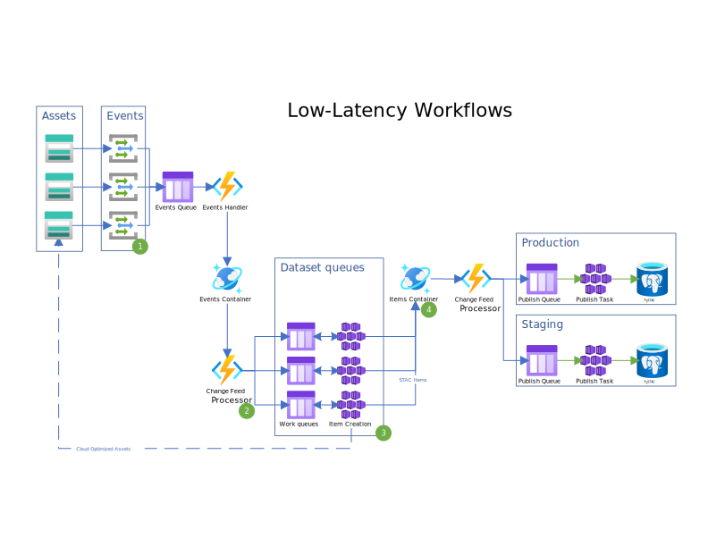

# Streaming Workflows

`pctasks` supports streaming item creation and ingestion into the pgstac
database. At a high level, Storage Events are persisted to a Cosmos DB
container. A Change Feed monitors that container for new events, and dispatches
them to dataset-specific work queues. By registering a streaming workflow with
`pctasks`, `pctasks` will monitor the storage account and process the messages
from each per-dataset queue.

## Writing a streaming workflow

A streaming workflow is similar to other pctasks workflows, but requires a few
additional properties on the streaming tasks within the workflow:

1. The workflow should have a single job with a single task.
2. The task must define the streaming-related properties using `args`:

   - `queue_url`
   - `visibility_timeout`
   - `min_replica_count`
   - `max_replica_count`
   - `polling_interval`
   - `trigger_queue_length`

3. The task must define the CPU and memory resources it requires using `resources`, which directly maps to Kubernetes [container resources](https://kubernetes.io/docs/concepts/configuration/manage-resources-containers/).

4. The workflow should set the top-level `is_streaming` property to `true`.

See
<https://github.com/microsoft/planetary-computer-tasks/blob/main/examples/workflow.yaml>
for an example.

In addition to these schema-level requirements, there are some expectations in
how the workflow behaves at runtime. In general, streaming tasks should run
indefinitely. They should continuously process messages from a queue, and leave
starting, stopping, and scaling to the pctasks framework (we use Kubernetes
Deployments and [KEDA] for that).

## Registering a streaming workflow

A streaming workflow is registered with `pctasks` like any other workflow,
using the `pctasks` CLI:

```
$ pctasks workflow create path/to/workflow.yaml
```

This will store the workflow in `pctasks`' database, but won't actually start
processing items from the stream.

## Running a streaming workflow

To actually start processing with a streaming workflow, you need to "submit"
the workflow.

```
$ pctasks workflow submit '<workflow_id>'
```

This will cause the actual compute resources to be created.

## Additional Azure Resources

Streaming workflows require a few additional Azure resources to be created:

1. A Cosmos DB database. This is managed outside of `pctasks`. The source events
   are configured to write to Cosmos DB outside of `pctasks`.
2. An AKS node pool dedicated to running streaming tasks (not technically necessary). This is managed by `pctasks` in `aks.tf`.
3. A Kubernetes namespace for streaming tasks (not technically necessary). This is managed by `pctasks`.
4. A Kubernetes secret for accessing the storage queues.
5. A Helm deployment of KEDA.
6. A KEDA `TriggerAuthentication` object in the same namespace as the streaming tasks.
7. A `storage-events` queue that receives event grid notifications from Blob Storage
8. An `ingest` queue that receives newly created STAC items from the Cosmos DB change feed.

## Permissions

The tasks running the streaming jobs need some additional permissions. Assuming
you've set `CLIENT_ID`, to the ID of the service principal running tasks and
`SUBSCRIPTION_ID`, `RESOURCE_GROUP`, and `STORAGE_ACCOUNT` to the correct values
for the Storage Account where the messages are being sent.

**pctasks operational storage containers**

`pctasks` uses a set of storage containers to manage task input and output,
logging, and code distribution. For batch tasks, the pctasks service takes care
of generating short-lived SAS tokens. Because streaming tasks are long-lived, we
instead rely on the managed identity having the proper access to each of these
containers (read for `code`, contributor for `taskio` and `status`).

```
❯ az role assignment create \
        --assignee "$CLIENT_ID" \
        --role "Storage Blob Data Contributor" \
        --scope "/subscriptions/$SUBSCRIPTION_ID/resourceGroups/$RESOURCE_GROUP/providers/Microsoft.Storage/storageAccounts/$STORAGE_ACCOUNT/blobServices/default/containers/taskio"

❯ az role assignment create \
        --assignee "$CLIENT_ID" \
        --role "Storage Blob Data Contributor" \
        --scope "/subscriptions/$SUBSCRIPTION_ID/resourceGroups/$RESOURCE_GROUP/providers/Microsoft.Storage/storageAccounts/$STORAGE_ACCOUNT/blobServices/default/containers/tasklogs"

❯ az role assignment create \
        --assignee "$CLIENT_ID" \
        --role "Storage Blob Data Reader" \
        --scope "/subscriptions/$SUBSCRIPTION_ID/resourceGroups/$RESOURCE_GROUP/providers/Microsoft.Storage/storageAccounts/$STORAGE_ACCOUNT/blobServices/default/containers/code"
```

**storage queue**

The streaming workflow tasks will receive messages from a queue, create STAC
items from the message. the `Storage Queue Data Contributor` role is required to
receive and delete the messages when they're successfully processed.

```
❯ az role assignment create \
        --assignee "$CLIENT_ID" \
        --role "Storage Queue Data Contributor" \
        --scope "/subscriptions/$SUBSCRIPTION_ID/resourceGroups/$RESOURCE_GROUP/providers/Microsoft.Storage/storageAccounts/$STORAGE_ACCOUNT"
```

**Cosmos DB**

The streaming workflow tasks will write their outputs to a Cosmos DB container.
Note that Cosmos DB requires the Object ID of the Enterprise Application associated with your Service Principal.

|          Name          |                                    Description                                     |
| ---------------------- | ---------------------------------------------------------------------------------- |
| COSMOS_DB_ACCOUNT_NAME | The name of your Cosmos DB account                                                 |
| RESOURCE_GROUP         | The name of your resource group                                                    |
| DATABASE_NAME          | The name of the database in your Cosmos DB account                                 |
| CONTAINER_NAME         | The name of the container in your Cosmos DB database                               |
| OBJECT_ID              | The object ID of the enterprise application associated with your service principal |


```
az cosmosdb sql role assignment create \
    --account-name "$COSMOS_DB_ACCOUNT_NAME"
    --resource-group "$RESOURCE_GROUP" \
    --scope "/dbs/$DATABASE_NAME/colls/$CONTAINER_NAME/" \
    --role-definition-id "00000000-0000-0000-0000-000000000002" \
    --principal-id "$OBJECT_ID"
```

## TaskIO Service Principal

The streaming implementation uses a dedicated Service Principal for interacting
with pctasks' storage container for loading task run messages and logging outputs.

The primary ETL Service Principal is still used for interacting with the data
containers.

## Implementation notes

This section describes the implementation of streaming workflows. It's mostly
useful for developers of `pctasks`, rather than end users. We'll refer to this
architecture diagram, which demonstrates a pipeline that generates STAC items
for new objects in Blob Storage, and ingests those items to a PgSTAC database:



Blob storage events kick off the whole process. These are configured outside of
`pctasks`. The events should all write to the same storage queue (see green
circle 1).

An Azure Function processes messages off this queue, writing those storage
events to a `storage-events` container in Cosmos DB. This is implemented in the
`StorageEventsQueue` function.

A second Azure Function processes messages off the `storage-events` container's
change feed. This function dispatches blob storage events to the appropriate
dataset queue for that storage event (see green circle 2). This is implemented
in the `StorageEventsCF` function.

When the user submits a streaming workflow with `pctasks workflow submit`, we
create a Kubernetes Deployment and a KEDA `ScaledObject` (see green circle 3).
This deployment will run the (user-provided) `create_item` code to make a STAC
item from the URL of the object triggering the Storage Event. The output is
written to the `items` container in Cosmos DB.

A third Azure Function monitors this `items` container for new items using its
change feed. It will forward the new items to a publish queue. An `ingest`
deployment (created once per database -- not once per dataset) will handle
ingesting these items into the PgSTAC database (see green circle 4).

### Azure Functions Configuration

This table documents the additional configuration values in the azure functions. Keys in bold are required.

|                   Key                   |                                                     Description                                                      |
| --------------------------------------- | -------------------------------------------------------------------------------------------------------------------- |
| **FUNC_STORAGE_EVENTS_COLLECTION_NAME** | The name of the Cosmos DB container the StorageEventsCF function should monitor.                                     |
| **FUNC_ITEMS_COLLECTION_NAME**          | The name of the Cosmos DB container the PublishItemsCF function should monitor.                                      |
| **FUNC_STORAGE_QUEUE_ACCOUNT_URL**      | The URL of the Azure Storage Account containing the various queues.                                                  |
| FUNC_STORAGE_ACCOUNT_KEY                | An optional access key to interact with storage queues. Ideally, managed identities and Azure RBAC are used instead. |

[KEDA]: https://keda.sh/